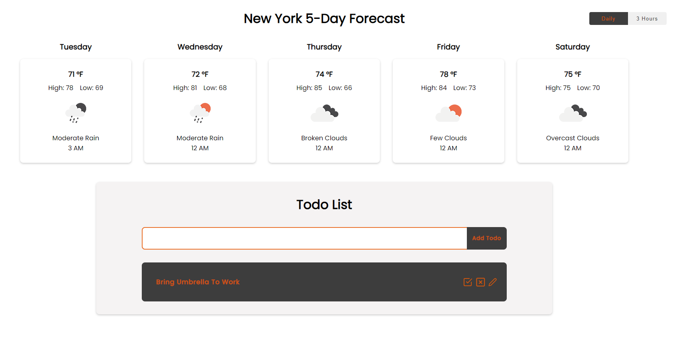
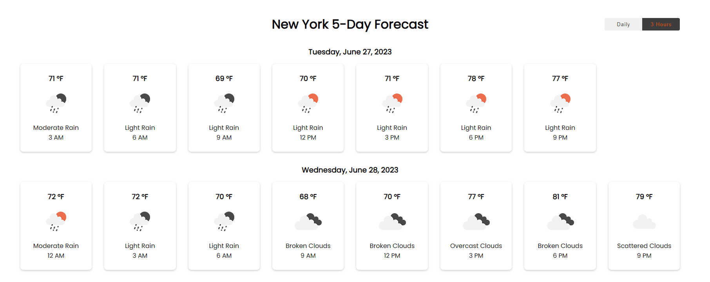
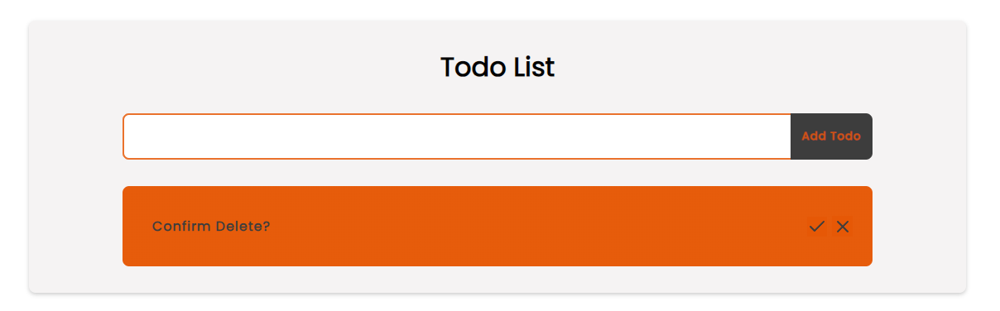
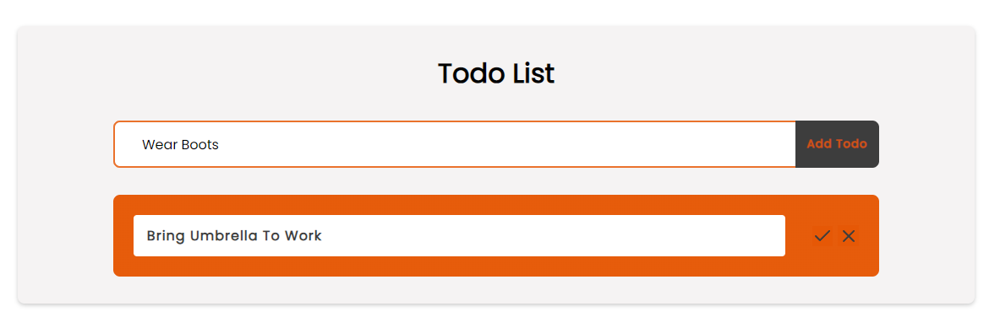
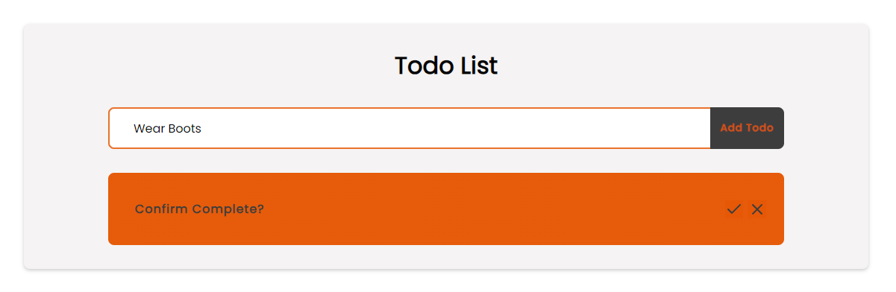

# New York Weather

New York Weather is an application that shows users information on New York's weather. Users can select either "Daily" or "3 Hour" to see the 5 day weather forecast for either the temperature for each day at a certain time or at 3 hour intervals. Below the forecast is also a feature that allows the user to write down any notes on what they want to do for the day.

Deployed site: https://new-york-weather.onrender.com/


## Installation

For users who would like to use the application locally:

To install all dependencies:

```bash
npm install
```

To start the application: 
```bash
npm run dev
```

To start the server:
```bash
npm run start
```
To run the application properly, make sure to have a MongoDB server link and OpenWeatherAPI key in the env files. Please take a look at the test.env files as a reference to your env files.

## Usage

Daily View: 



3 Hour View: 



Todo List:

To add a todo, type into the input bar and click "Add Todo". The todo should appear underneath the input.

To delete a todo, click on the boxed X icon. You will then be asked to confirm delete. To delete the todo, press the check. To cancel, press the X.



To edit a todo, click on the pen icon. An input bar with the original todo will appear. To edit, type in the new todo and press check. To cancel, press the X.



To mark complete a todo, click on the boxed check icon. You will then be asked to confirm mark complete. To mark complete the todo, press the check. To cancel, press the X.



